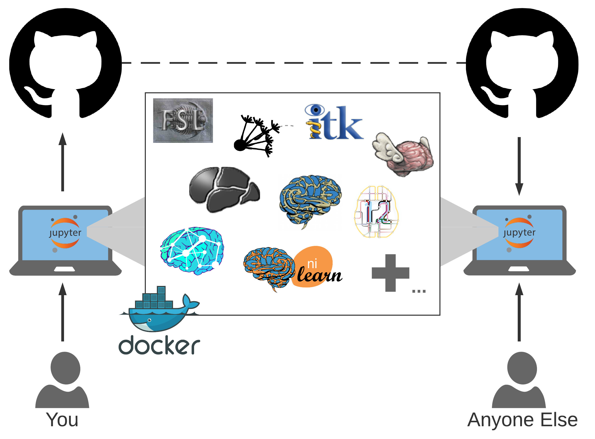

# scratch-the-dura
Begin to learn how to leverage Git, Docker, Jupyter, and various neuroinformatics tools for performing exciting science!

## The Desiderata
A valuable feature of science, in particular computationally-driven science, is reproducibility. When performing or reproducing
analyses there are several key features that can make this reproducibility particularly effective. Some of these are:

- the ability for anyone to download/access all tools and data used
- the ability for anyone to install or use the tools and data on their own
- interactive demonstrations showing how to use tools and interact with data
- the ability to test the robustness of findings/claims

Leveraging several popular open-source or accessible tools, all of these requirements can be easily met, providing a solid
base upon which we can develop, test, extend, or distribute scientific findings.

## The Resources
We propose one possible model for achieving all of these requirements - note that there are alternatives to each of these tools that
may be better for specific circumstances or applications, and the selected were chosen simply based upon popularity and general
usefulness.

To share data and code, we use Github\*. To ensure anybody can install and use our tool, we use Docker. To provide interactive
demonstrations, we use Jupyter Notebooks to showcase our Python code. To enable testing the robustness of our claims, we integrate
analyses with Jupyter Widgets.

\**Note: Github is generally **not** the best place to store data, but in this particular example we use it since this tutorial
focuses primarily on tools, and the data files being stored are small. In practice, storing data through either a public data
repository (such as NITRC, LONI, LORIS, OpenfMRI, etc.) or on the Cloud are better solutions.*

## The Structure
For those of us who are visual learners, we can study the figure below to understand how each of these pieces fits together.

Using a containerized environment such as Docker, we can develop code locally and interact through a web interface via Jupyter.
Inside our environment we can leverage or study any number of tools, such as a few of the neuroimaging tools shown. As we make
progress, we save our work, and push the changes up to Github to serve as both our "cloud copy" and to communicate our progress
to the public. Any other user can pull down our repository from Github, launch the container, and perform the same analyses we've
shared.

## The Plan
As there are several pieces of this which are separable from one another, we will tackle each piece independently. We will begin by
uncovering (some of) the secrets of Github. We will then learn how to leverage Docker for packaging and deploying code portably.
Putting our new skills to the test, we can setup our own Jupyter server. Lastly, we'll showcase some tools and demonstrate how to
integrate Widgets into analyses for sharing interactive science.

## Getting Started
There are many helpful articles on how to get started with each of these tools, and we don't want to replace them. We aim to just
shed some light on features that enable you to open the door, get your feet wet, and explore more when you're comfortable.

- [Learn Github](./tutorials/github.md)
- [Learn Docker](./tutorials/docker.md)
- [Learn Jupyter](./tutorials/jupyter.md)
- [Learn Interactive Science](./tutorials/science.md)
